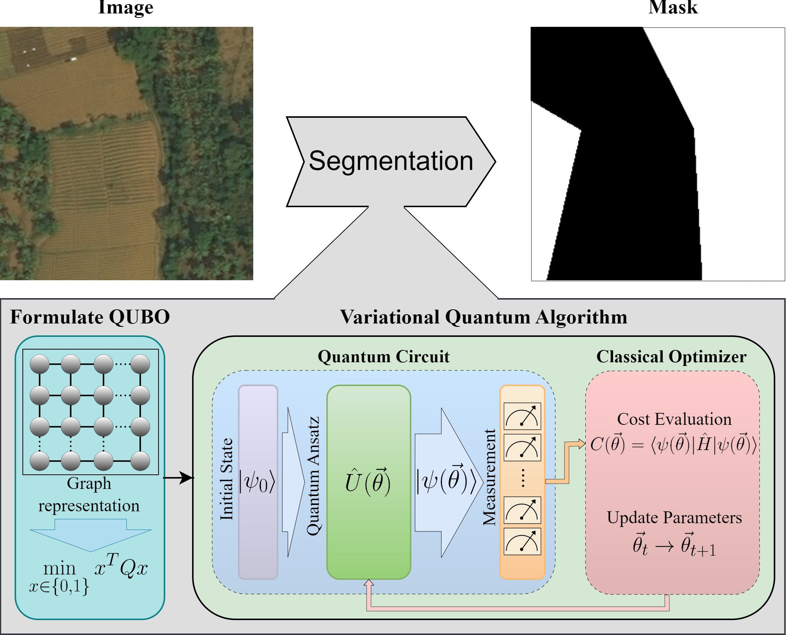
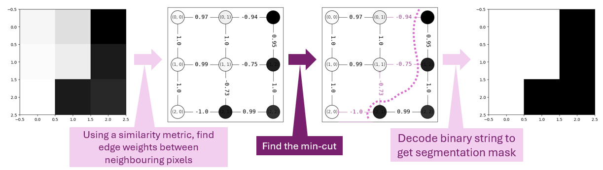

# **Pennylane-ImageSegmentation: Qubit-Efficient Variational Quantum Algorithms for Image Segmentation**

[](https://doi.org/10.1109/QCE60285.2024.00059)  
[](https://doi.org/10.48550/arXiv.2405.14405)  
[](https://qce.quantum.ieee.org/2024/)  
[](https://www.gnu.org/licenses/old-licenses/lgpl-2.1.html)  
[](https://www.linkedin.com/in/supreethmv/)  
[](https://www.supreethmv.com)

<figure>
  
  <figcaption>
    Architecture for segmenting an image by transforming it into a graph and solving the corresponding minimum cut as a QUBO problem using variational quantum circuits
  </figcaption>
</figure>

---

## **Overview**

Welcome to **NISQ-Seg**, the official repository for the paper **"Qubit-efficient Variational Quantum Algorithms for Image Segmentation"**, accepted at the Quantum Computing and Engineering 2024 (QCE'24) conference by IEEE. This repository provides the full pipeline for reproducing the experimental results and demonstrations of the three primary encoding methods introduced in the paper:

<figure>
  
  <figcaption>
    Image is converted to an undirected weighted graph with similarity of the pixels as the edge weight metric, then solving the minimum cut obtains the segmentation of the image.</a>
  </figcaption>
</figure>


1. **Parametric Gate Encoding (PGE)**
2. **Ancilla Basis Encoding (ABE)**
3. **Adaptive Cost Encoding (ACE)**


These quantum techniques are optimized for **Noisy Intermediate-Scale Quantum (NISQ)** devices and demonstrate efficient qubit usage for **graph-based image segmentation** tasks.

### **Paper Preprint**
The preprint is available on [arXiv](https://doi.org/10.48550/arXiv.2405.14405).

### **Link to Official repo in Qiskit**
The official repository is implemented in Qiskit [GitHub](https://github.com/supreethmv/NISQ-Seg)

---

Explore the different encoding methods by running the provided Jupyter notebooks:

- `tutorial.ipynb`: A walkthrough of the image segmentation pipeline for a 4x4 image.

---

## **Citing this Work**

If you find this code useful in your research, please cite the following paper:

```bibtex
@INPROCEEDINGS{10821431,
  author={Venkatesh, Supreeth Mysore and Macaluso, Antonio and Nuske, Marlon and Klusch, Matthias and Dengel, Andreas},
  booktitle={2024 IEEE International Conference on Quantum Computing and Engineering (QCE)}, 
  title={Qubit-Efficient Variational Quantum Algorithms for Image Segmentation}, 
  year={2024},
  volume={01},
  pages={450-456},
  doi={10.1109/QCE60285.2024.00059}
  }
```

---

## **Contact**

**Supreeth Mysore Venkatesh**  

For any inquiries, please reach out to:

- Email: contact@supreethmv.com  
- LinkedIn: [Supreeth Mysore Venkatesh](https://www.linkedin.com/in/supreethmv/)  
- Website: [www.supreethmv.com](https://www.supreethmv.com)


## Contributors

[](https://www.supreethmv.com)